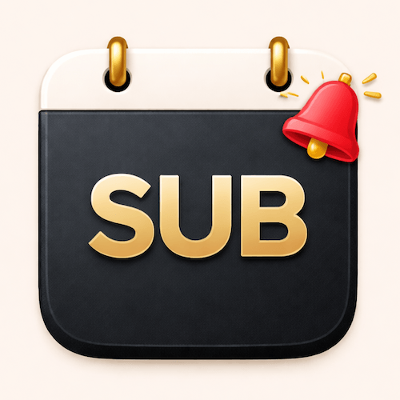
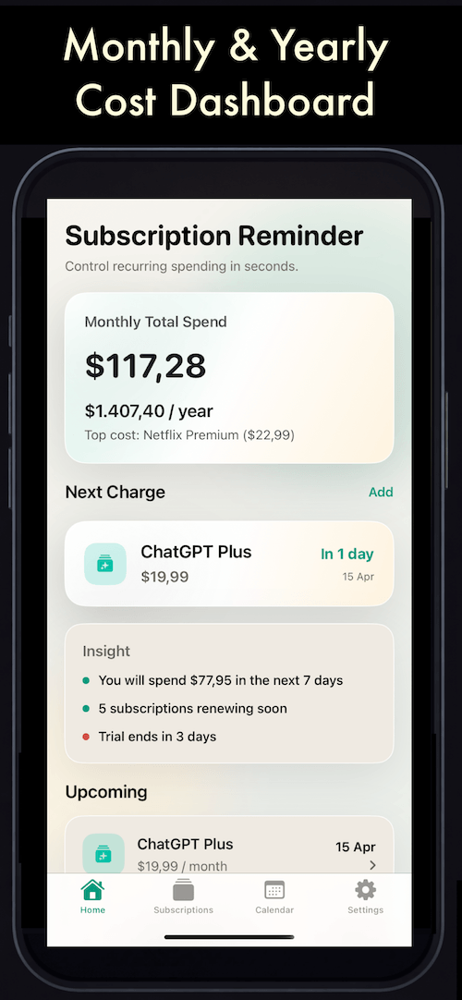
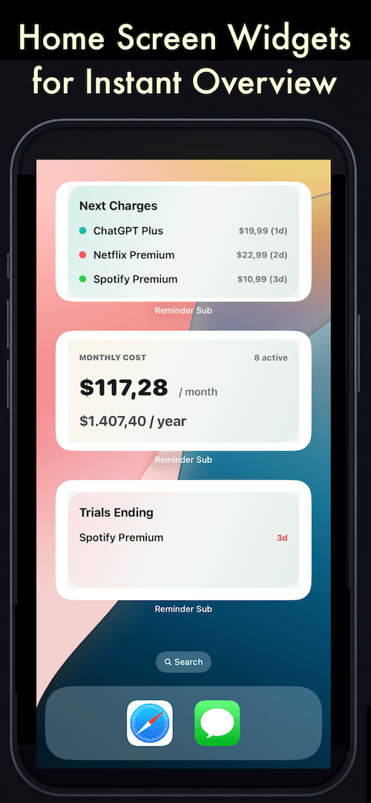
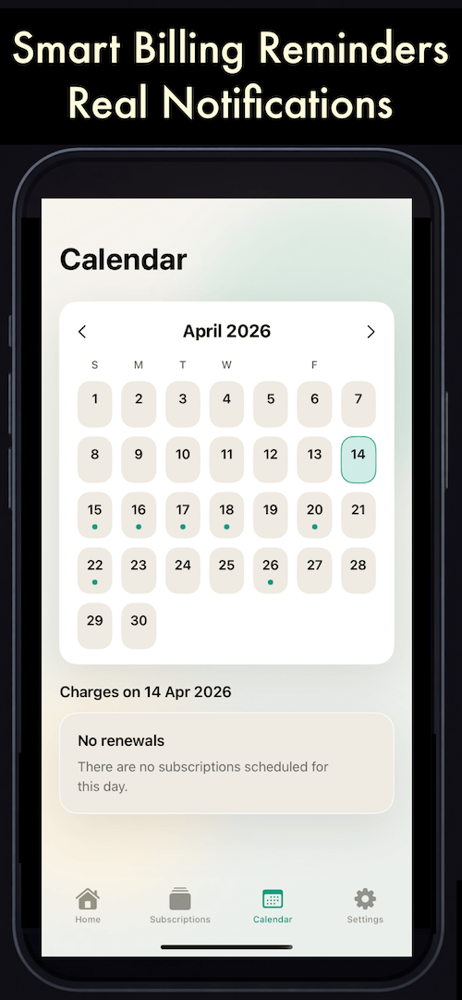

  

<h1 align="center">Reminder: Subscription Tracker</h1>

  Never get charged unexpectedly. Track subscriptions with full privacy.

  

---

## 📱 Preview

  
  
  

---

## ✨ Overview

Stay in control of your subscriptions and avoid unexpected charges.

Track everything in one place — fast, private, and fully offline.  
No accounts. No cloud. No tracking.

---

## 🔥 Features

### ▶ 100% Offline & Private
- No cloud, no account, no tracking  
- All data stays on your device  
- Built for true privacy  

---

### ▶ Smart Subscription Tracking
- Add subscriptions in seconds  
- Support monthly, yearly, and custom billing cycles  
- Mark as Paid to instantly move to the next billing date  

---

### ▶ 🔔 Never Miss a Payment
- Billing reminders (same day, 1 day, 3 days before)  
- Trial ending alerts  
- Notifications update automatically when you edit or mark as paid  

---

### ▶ 🧪 Free Trial Tracker
- Track trial subscriptions easily  
- Stay aware of upcoming charges  
- See what’s expiring soon at a glance  

---

### ▶ 📊 Powerful Dashboard
- Monthly spending overview  
- Yearly cost estimation  
- Next upcoming charge  
- 7-day spending insights  

---

### ▶ 📅 Upcoming & Calendar View
- See all upcoming renewals  
- Calendar highlights charge dates  
- Tap any day to view details  

---

### ▶ 🧩 Home Screen Widgets
- Next Charge widget  
- Monthly Cost overview  
- Trial countdown  
- Tap to open directly in app  

---

### ▶ ⚡ Quick Access to Manage Subscriptions
- Open official subscription management pages quickly  
- Save time navigating through settings  

---

### ▶ 🔒 Optional App Lock
- Protect your data with a secure 6-digit PIN  

---

### ▶ 🎯 Fast & Clean Experience
- Simple list with all subscriptions  
- Sort by date, price, or name  
- Swipe to edit, delete, or mark as paid  

---

## ⚠️ Important Note

This app does **not** cancel subscriptions automatically.  
It helps you track, manage, and set reminders so you stay in control.

---

## 🚀 Why This App?

Most subscription apps rely on accounts, cloud sync, and tracking.  
This app takes a different approach:

- Fully offline  
- Privacy-first  
- Instant and lightweight  
- No unnecessary complexity  

Everything you need — nothing you don’t.

---

## 📥 Download

👉 https://apps.apple.com/us/app/reminder-subscription-tracker/id6762199144

---

## 🧠 Built for Simplicity

Clean design. Instant control.  
Take back your money — and your peace of mind.
